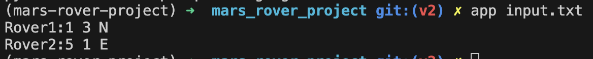
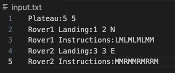
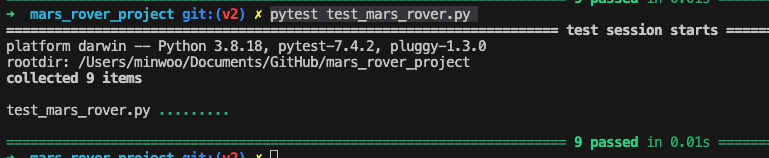

# Mars_rover_project


# Requirements

'python3.6+' is required to use  [f-strings](https://www.python.org/dev/peps/pep-0498/)

'pip' is required to install following package:
```
$ pip install -r requirements.txt
```

# To run the application
Using python command to run the app:
```
# (Step 1) To create the python virtual environment.
$ python3 -m venv env

# (Step 2) To activate the python virtual environment.
$ source env/bin/activate

# (Step 3) Install the requirements.txt.
$ pip install -r requirements.txt

# (Step 4) Run the application. The application name is app.
$ app input.txt
```
# Expected output
If you run the app, the result should be look like this:


# Input.txt
input.txt should be look like this format.


# Run the test codes

Using pytest, to run the test code:
```
$ pytest test_mars_rover.py  
```

and the result of the test should look like this:

